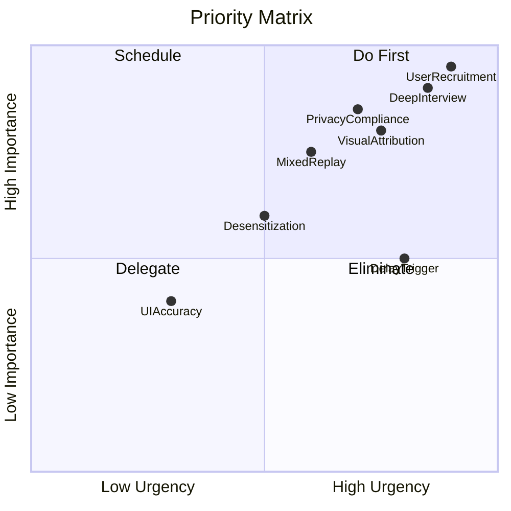
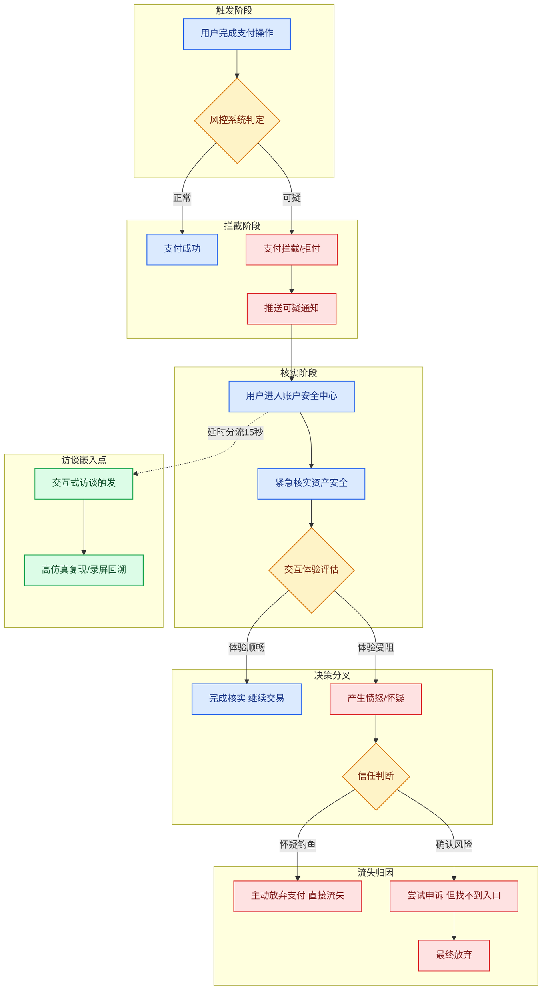
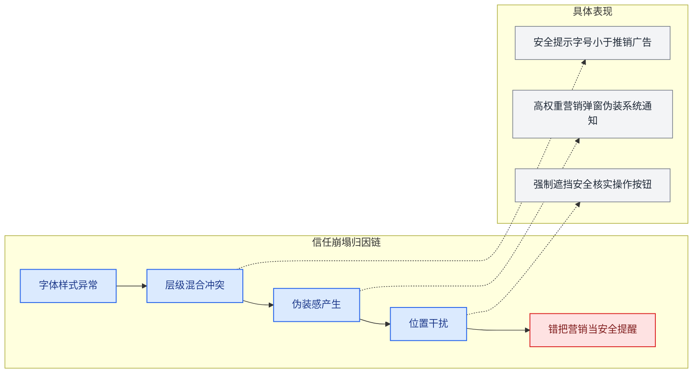
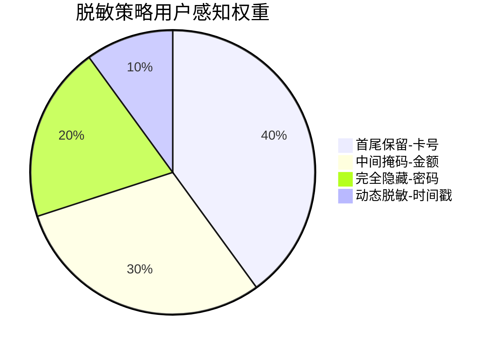
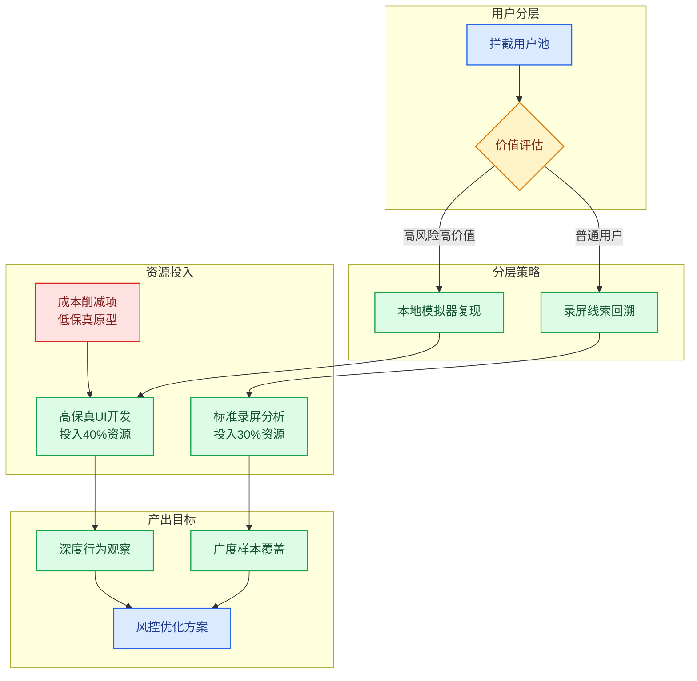
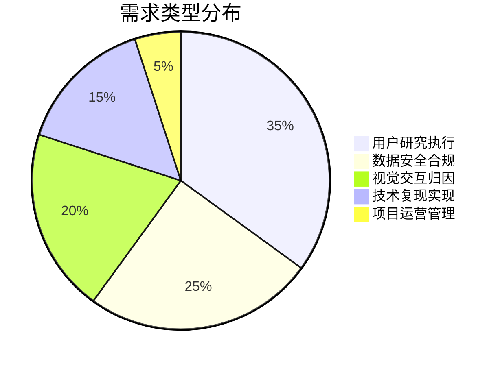
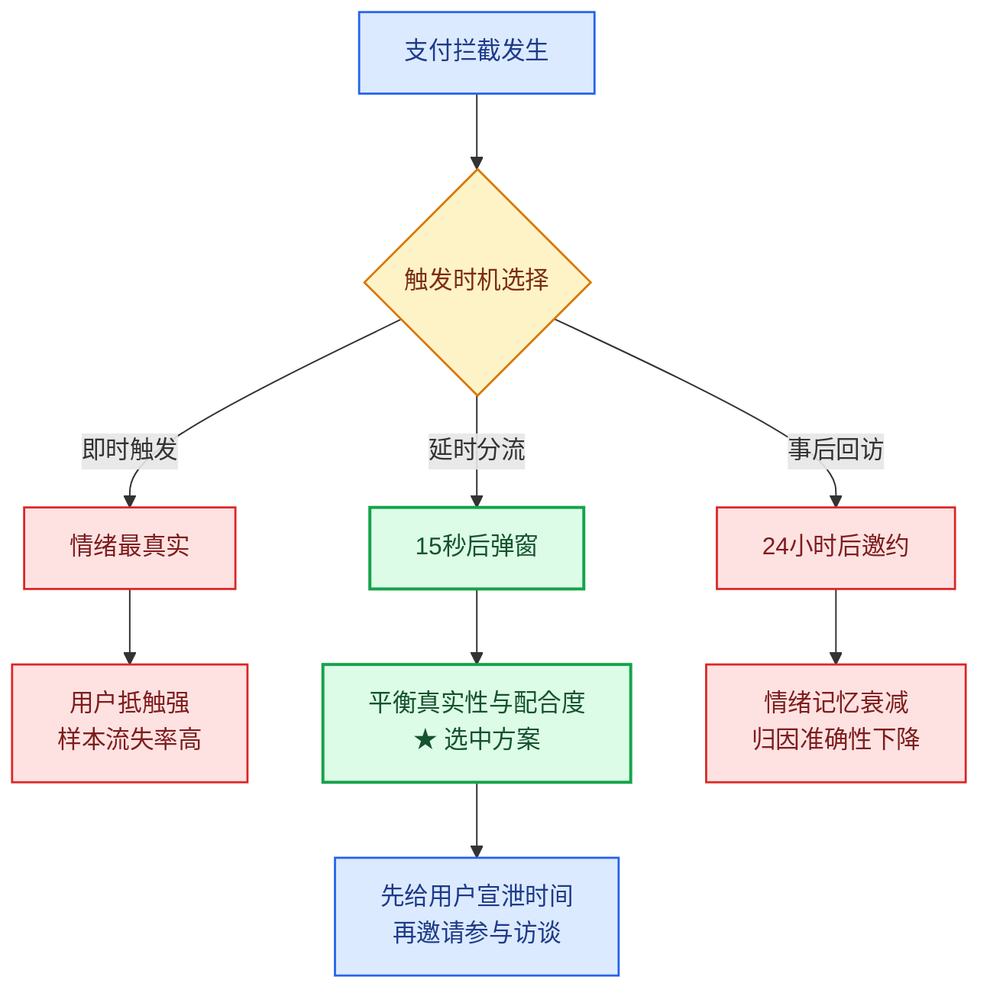

# 交互式访谈产品需求调研报告

---

## 1. 访谈概述

### 1.1 基本信息

| 项目 | 内容 |
|:---|:---|
| **访谈主题** | 交互式访谈产品需求调研 |
| **客户行业** | 消费级互联网/电商（B2C） |
| **业务场景** | 用户体验与售后调研（优化现有服务） |
| **核心痛点** | 数据洞察深度不足——回收数据多为无效或敷衍回答，难以挖掘真实痛点和归因 |
| **项目周期** | 2-3个月 |
| **访谈日期** | 2024年 |

### 1.2 访谈背景

本次访谈聚焦于B2C电商平台在"交易支付环节风控体验"领域的深度用户研究需求。客户希望通过交互式访谈产品，精准还原用户在遭遇"误拦截/拒付"时的心理决策路径，特别是挖掘"为何放弃支付而非申诉"这一替代方案决策背后的深层动机——**对资金安全的过度敏感（怀疑账号被盗，产生恐慌从而主动停止）**。

访谈覆盖了四大维度：**客户需求、业务流程、技术约束、项目约束**，逐步收敛至可落地的执行方案。

---

## 2. 需求摘要

### 2.1 核心需求列表

| 序号 | 需求类别 | 需求描述 | 关键指标 |
|:---:|:---|:---|:---|
| 1 | **场景聚焦** | 交易支付环节风控体验研究 | 误拦截/拒付率高的归因分析 |
| 2 | **心理挖掘** | 还原用户"放弃支付而非申诉"的决策逻辑 | 资金安全恐慌心理的触发机制 |
| 3 | **流程嵌入** | 账户安全中心主动查询环境的访谈触发 | 收到可疑通知后的紧急核实场景 |
| 4 | **归因细化** | UI/视觉层致错点识别（字体样式异常、层级混合冲突） | 营销弹窗伪装系统通知的"位置干扰" |
| 5 | **技术合规** | 本地加密脱敏，数据隐私合规 | 首尾保留脱敏策略的用户感知 |
| 6 | **用户招募** | 无偏差招募"真实被风控/拦截"高价值用户 | 支付失败页/拦截页定向投放 |
| 7 | **执行策略** | 深度访谈执行质量保障 | 延时分流（15秒）+ 混合复现模式 |

### 2.2 优先级矩阵

**象限图中文图例说明**：
- **横轴**：紧急程度（左低右高）
- **纵轴**：重要程度（下低上高）
- **Do First（立即执行）**：右上象限，重要且紧急
- **Schedule（计划执行）**：左上象限，重要但不紧急
- **Delegate（可委派）**：右下象限，紧急但不重要
- **Eliminate（低优先级）**：左下象限，不重要不紧急

| 数据点 | 对应需求名称 |
|:---|:---|
| UserRecruitment | 真实用户无偏差招募 |
| DeepInterview | 深度访谈执行质量保障 |
| PrivacyCompliance | 数据隐私合规与本地加密 |
| VisualAttribution | UI/视觉层致错点归因分析 |
| MixedReplay | 混合模式复现策略 |
| Desensitization | 数据脱敏颗粒度优化 |
| DelayTrigger | 延时分流触发机制 |
| UIAccuracy | 复现功能UI还原精度 |

### 2.3 优先级清单

| 优先级 | 需求项 | 说明 |
|:---:|:---|:---|
| 🔴 **P0 立即执行** | 真实用户无偏差招募、深度访谈执行质量保障 | 2-3个月周期的核心瓶颈，直接决定数据有效性；需在项目启动首周即启动招募渠道建设 |
| 🟡 **P1 计划执行** | 数据隐私合规与本地加密、UI/视觉层致错点归因分析 | 重要基础能力，需在访谈执行前完成技术方案确认；视觉归因分析需与UX团队深度协同 |
| 🟢 **P2 可委派** | 混合模式复现策略、延时分流触发机制 | 有成熟方案可参考，可交由执行团队按标准流程实施；需预留15%时间buffer应对异常 |
| ⚪ **P3 低优先级** | 数据脱敏颗粒度优化、复现功能UI还原精度 | 可在MVP阶段接受低保真实现，后续迭代优化；明确列为成本削减项 |

---

## 3. 详细需求分析

### 3.1 客户/用户需求

#### 3.1.1 核心痛点

| 层级 | 痛点描述 | 深层诉求 |
|:---|:---|:---|
| **表层** | 售后调研效率与体验矛盾 | 快速回收数据 vs. 让用户感到被尊重 |
| **中层** | 数据洞察深度不足 | 无效/敷衍回答多，难以挖掘真实痛点 |
| **深层** | 误拦截用户的心理黑箱 | 无法理解"为何放弃支付而非申诉"的决策逻辑 |

#### 3.1.2 目标用户画像

| 维度 | 特征描述 |
|:---|:---|
| **触发场景** | 收到可疑登录/资金变动通知后，进入账户安全中心紧急核实 |
| **心理状态** | 高焦虑、恐慌、对资金安全过度敏感 |
| **行为特征** | 核实过程中因交互受阻（找不到客服/入口），产生愤怒并直接流失 |
| **核心恐惧** | 怀疑遭遇钓鱼诈骗，信任崩塌 |

#### 3.1.3 用户期望

- **情感层面**：在恐慌时刻获得清晰、可信的安全指引
- **功能层面**：快速核实资产安全，无障碍找到人工客服
- **信任层面**：页面视觉专业、无歧义，杜绝"营销感"干扰

### 3.2 业务流程

#### 3.2.1 关键业务流程图

#### 3.2.2 关键决策节点

| 节点 | 决策内容 | 用户心理 | 访谈价值 |
|:---|:---|:---|:---|
| **风控判定** | 系统是否拦截 | 无感知 | 低 |
| **通知解读** | 是否认定可疑 | 警觉/困惑 | 中 |
| **入口选择** | 进入安全中心或其他渠道 | 急迫 | 中 |
| **交互体验** | 能否快速找到核实入口 | 焦虑升级 | **高** |
| **信任判断** | 页面是否可信 | **恐慌/怀疑** | **最高** |
| **方案选择** | 继续核实/放弃/申诉 | **决策黑箱** | **最高** |

#### 3.2.3 视觉致错点细化

### 3.3 技术约束

#### 3.3.1 核心技术要求

| 约束类别 | 具体要求 | 实现策略 |
|:---|:---|:---|
| **数据安全** | 支付/风控交互数据本地加密脱敏 | 端到端加密，敏感字段首尾保留掩码 |
| **性能平衡** | 紧急核实场景的高响应速度 | 边缘计算+本地预处理，避免云端往返 |
| **合规规范** | 符合数据安全法规（等保、PCI-DSS等） | 审计日志留存，最小必要原则 |

#### 3.3.2 脱敏策略用户感知

**关键发现**：用户最关注"首尾保留"策略（如6222...8888）在**隐私保护与信息核对效率**之间的平衡，需在访谈中重点探测其安全感阈值。

### 3.4 项目约束

#### 3.4.1 资源分配策略

| 约束维度 | 具体限制 | 应对策略 |
|:---|:---|:---|
| **时间** | 2-3个月全周期 | 首周启动招募，第2-4周密集执行访谈，第5-8周分析优化 |
| **预算** | 高价值用户招募成本高 | 混合招募（定向投放为主，模拟器复现仅用于高风险用户） |
| **质量** | 深度访谈需保证情绪宣泄时间 | 单用户访谈时长不设上限，以获取真实归因为准 |
| **成本削减项** | 复现功能UI还原精度 | 接受低保真原型，优先保障交互逻辑还原 |

#### 3.4.2 混合复现模式架构

---

## 4. 可视化分析

### 4.1 需求分布概览

### 4.2 访谈触发时机决策

---

## 5. 方案建议

### 5.1 产品方案框架

| 模块 | 核心功能 | 实现要点 |
|:---|:---|:---|
| **智能触发引擎** | 基于用户行为信号的访谈时机预测 | 拦截后15秒自动触发，支持情绪强度实时评估 |
| **多模态复现系统** | 高仿真模拟器 + 录屏回溯双模式 | 分层用户策略，低保真UI优先保障交互逻辑 |
| **隐私计算层** | 本地加密脱敏，端到端安全 | 首尾保留策略可配置，支持用户自定义颗粒度 |
| **视觉归因分析** | 眼动追踪 + 热力图 + 语义分析 | 重点识别"位置干扰"类视觉误导 |
| **情绪洞察引擎** | 语音/文本/行为多维度情绪识别 | 恐慌、愤怒、怀疑等关键情绪标签自动标注 |

### 5.2 关键创新点

1. **"延时分流"触发机制**：首创在支付拦截场景下平衡数据真实性与用户体验的触发策略
2. **"混合复现"成本优化**：通过用户分层实现研究深度与执行成本的帕累托最优
3. **"视觉权重错位"归因模型**：将UI设计问题转化为可量化、可访谈的心理决策变量

---

## 6. 风险评估

| 风险类别 | 风险描述 | 发生概率 | 影响程度 | 应对策略 |
|:---|:---|:---:|:---:|:---|
| **招募风险** | 真实被拦截用户招募困难，样本偏差 | 高 | 高 | 多渠道并行（支付失败页定向+客服邀约+社群招募），设置筛选问卷验证真实性 |
| **情绪风险** | 访谈复现触发用户二次创伤，引发投诉 | 中 | 高 | 伦理审查前置，设置紧急退出机制，配备心理支持话术，事后补偿机制 |
| **技术风险** | 本地模拟器开发延期，影响MVP交付 | 中 | 中 | 明确低保真原型可接受范围，录屏方案作为保底，分阶段交付 |
| **合规风险** | 支付数据脱敏策略不符合监管要求 | 低 | 高 | 法务合规前置评审，采用业内成熟脱敏方案，预留审计接口 |
| **数据风险** | 用户"表演性"回答，真实归因挖掘失败 | 中 | 高 | 行为观察优先于自我报告，引入"回放复现"刺激触点，交叉验证多源数据 |

---

## 7. 下一步行动

| 序号 | 行动项 | 负责人 | 截止时间 | 交付物 | 依赖条件 |
|:---:|:---|:---|:---:|:---|:---|
| 1 | 确认用户招募渠道与合作方 | 项目经理 | T+3天 | 招募渠道清单及合作协议 | 法务合规确认 |
| 2 | 完成隐私计算技术方案评审 | 技术负责人 | T+5天 | 技术设计文档及安全评估报告 | 安全团队资源 |
| 3 | 设计低保真模拟器原型 | UX设计师 | T+7天 | 可点击原型及交互流程图 | 业务方输入确认 |
| 4 | 制定访谈执行SOP及伦理规范 | 用研负责人 | T+7天 | 访谈手册、知情同意书、风险预案 | 法务合规确认 |
| 5 | 搭建数据脱敏配置后台 | 后端工程师 | T+10天 | 可配置脱敏规则的管理界面 | 技术方案评审通过 |
| 6 | 启动首批试点用户招募 | 运营团队 | T+14天 | 50名符合条件的被拦截用户池 | 招募渠道就绪 |
| 7 | 完成首轮深度访谈执行 | 用研团队 | T+28天 | 10份完整访谈记录及初步洞察 | 用户池就绪、SOP就绪 |
| 8 | 输出风控交互优化方案V1 | 项目组 | T+56天 | 优化建议报告及优先级排序 | 访谈数据分析完成 |
| 9 | 方案评审及迭代确认 | 业务方+项目组 | T+70天 | 终版优化方案及落地计划 | 业务方决策人时间 |
| 10 | 交付最终报告及知识转移 | 项目组 | T-84天 | 完整项目文档及培训材料 | 方案评审通过 |

**关键里程碑**：
- **M1（第2周）**：招募渠道就绪，技术方案冻结
- **M2（第4周）**：首轮访谈完成，初步洞察验证
- **M3（第8周）**：优化方案交付，项目验收

---

*此报告由 Intus 见真生成*

---

## 附录：完整访谈记录

本次访谈共收集了 31 个问题的回答

**【客户需求】问题 1：首先，为了更准确地理解您的业务场景，请问您所在的行业领域是？**

<strong>回答：</strong>

☐ 企业级软件/SaaS (B2B)

☑ 消费级互联网/电商 (B2C)

☐ 教育培训/知识付费

☐ 金融/医疗/政务 (垂直行业)

---

**【客户需求】问题 2：感谢您的确认。在 B2C 电商业务中，交互式访谈往往应用于不同的环节。请问您目前最关注的具体业务场景是哪一个？**

<strong>回答：</strong>

☐ 新品研发与需求挖掘（挖掘潜在需求）

☑ 用户体验与售后调研（优化现有服务）

☐ 营销活动效果评估（提升转化率）

☐ 购物旅程中的个性化推荐

---

**【客户需求】问题 3：您提到的“用户体验与售后调研”是一个非常关键的环节。为了确保交互式访谈能精准解决您的问题，请问您目前在这个场景下面临的最大痛点具体是什么？**

<strong>回答：</strong>

☐ 传统问卷回收率低，用户缺乏耐心填完

☐ 只能收集到分数，无法深度挖掘用户真实想法

☐ 售后场景情绪复杂，AI 难以有效安抚或应对

☐ 缺乏自动化手段，人工访谈成本过高

☑ 其他（自由输入）：效率于体验

---

**【客户需求】问题 4：您提到的‘效率与体验’是售后调研的核心矛盾。在售后访谈中，效率通常指“快速完成并获取数据”，体验则指“让用户感到被尊重”。请问您目前最迫切想要解决的具体问题是以下哪一项？**

<strong>回答：</strong>

☐ 触达与回收效率：问卷/访谈邀约打开率低，且用户因流程繁琐中途流失

☑ 数据洞察深度：虽然回收了数据，但多为无效或敷衍回答，难以挖掘真实痛点和归因

☐ 用户情绪安抚：售后调研增加了用户的打扰感，反而加剧了不满情绪

☐ 资源投入产出：人工访谈成本太高，纯机器问卷又太冰冷，难以平衡效果与成本

---

**【客户需求】问题 5：为了解决数据深度不足的问题，交互式访谈通常利用“特定触发节点”来还原用户的真实体验。您希望优先在哪个环节切入，以捕捉用户最真实的情绪与痛点？**

<strong>回答：</strong>

☐ 售后结束时即时触发（利用记忆新鲜度，提升反馈真实性与细节）

☐ 用户主动发起咨询或投诉时（利用高情绪唤醒，挖掘深层归因）

☐ 用户活跃度异常/流失前预警（基于行为数据，精准挽回）

☐ 定期/特定节点关怀（建立情感连接，侧重长期满意度）

☑ 其他（自由输入）：活跃度和安全性

---

**【客户需求】问题 6：这是一个非常有趣的切入点。在售后调研中关注“活跃度与安全性”确实与众不同。为了更精准地构建访谈逻辑，请问您指的“活跃度与安全性”具体是指以下哪种场景？**

<strong>回答：</strong>

☐ 账户登录安全与防盗用

☑ 交易支付环节的风控体验

☐ 会员活跃度与权益感知

☐ 互动问答机制（如验证码、签到）

---

**【客户需求】问题 7：聚焦于“交易支付环节的风控体验”是一个极具价值的切入点。为了设计能精准还原用户心理的交互式访谈，请问您希望优先解决以下哪类具体的风控交互痛点？**

<strong>回答：</strong>

☑ 误拦截/拒付率高的归因（挖掘被误伤用户的心理特征）

☐ 强校验流程（如3DS/刷脸）导致的用户流失原因

☐ 风控策略差异（国内/海外）对用户体验的不同影响

☐ 高风险行为的用户画像识别（如欺诈用户的异常回答模式）

---

**【客户需求】问题 8：挖掘被误伤用户的心理特征是设计访谈的关键。为了更精准地构建访谈逻辑，您希望在访谈中侧重还原用户在遭遇误拦截时的哪种具体心理状态或决策路径？**

<strong>回答：</strong>

☐ 受阻时的情绪爆发点（如愤怒转为流失的临界阈值）

☐ 安全验证流程中的认知负荷（如是否理解风控提示）

☐ 对平台的信任崩塌机制（如误伤后对品牌安全性的质疑）

☑ 替代方案的决策逻辑（如被拦截后为何放弃支付而非申诉）

---

**【客户需求】问题 9：挖掘用户在支付被拦截时的心理决策逻辑非常关键，这直接关系到流失归因。针对“为何放弃支付而非申诉”这一替代方案决策，您希望访谈重点还原用户在遭遇拦截瞬间的哪种具体心理归因或动机？**

<strong>回答：</strong>

☑ 对资金安全的过度敏感（怀疑账号被盗，产生恐慌从而主动停止）

☐ 对申诉门槛的抗拒（担心流程繁琐、需要上传资料，觉得“不值得”）

☐ 对交易紧迫性的权衡（因支付时效限制，被迫转用其他支付方式而放弃原渠道）

☐ 对系统判罚的不信任（认为平台误判，产生逆反心理，赌气放弃交易）

---

**【业务流程】问题 10：为了实现针对“支付拦截风控体验”的交互式访谈，我们需要确定关键的触发流程节点。您希望访谈逻辑主要嵌入在哪个具体的业务环节中，以精准捕获用户在“误拦截”瞬间的真实心理？**

<strong>回答：</strong>

☐ 支付失败后的即时拦截页（弹窗/落地页）

☐ 交易完成后的售后回访（短信/APP推送）

☐ 客服介入后的投诉/申诉处理流程

☑ 账户安全中心的主动查询环境

---

**【业务流程】问题 11：针对“账户安全中心的主动查询”这一场景，用户通常是在何种心理驱动或外部触发下进入该页面的？您希望访谈逻辑侧重于以下哪类具体的“主动查询”细分路径？**

<strong>回答：</strong>

☐ 针对特定交易失败的事后追查（核对拦截原因）

☑ 收到可疑登录/资金变动通知后的紧急核实（归因恐慌心理）

☐ 周期性的账户体检/安全评分查看（关注主动防御意识）

☐ 被风控系统引导点击“解除限制”后的路径确认

---

**【业务流程】问题 12：用户在收到“可疑通知”后进入“账户安全中心”进行紧急核实时，具体操作的路径十分关键。针对“替代方案的决策逻辑”，您希望访谈重点锁定在用户验证资产安全后的哪种具体行为分支？**

<strong>回答：</strong>

☐ 核实资产无误后，直接支付下单（拦截后的恢复转化）

☐ 核实无误但放弃下单，转向其他平台购买（拦截导致的竞品流失）

☐ 核实后担心仍有风险，选择修改密码或更换支付方式（风险应对策略）

☑ 核实过程中因交互受阻（找不到客服/入口），产生愤怒并直接流失（体验恶化）

---

**【业务流程】问题 13：针对您提到的“找不到客服/入口”这一交互受阻点，在访谈中我们需要锁定最核心的致错要素。您希望重点深挖用户在核实资产安全过程中，因哪种具体的界面设计或流程缺失而导致的愤怒流失？**

<strong>回答：</strong>

☐ 关键帮助信息缺失（如无悬浮窗/即时反馈导致无助感）

☐ 导航逻辑冲突（安全页客服入口过深或被风控屏蔽）

☐ 客服触达失败（入口存在但点击无效/无响应/流程中断）

☑ 信任崩塌（因交互繁琐质疑系统真实意图，担心钓鱼）

---

**【业务流程】问题 14：针对用户因怀疑“钓鱼风险”而产生的信任崩塌与流失，您希望交互式访谈重点深挖以下哪种具体的“归因路径”或“交互致错点”？**

<strong>回答：</strong>

☑ UI/视觉层的归因（如：页面设计简陋、字体异常、链接种类歧义）

☐ 流程/逻辑层的归因（如：步骤冗余强制跳转、无法返回上一级、验证逻辑过于严苛）

☐ 内容/话术层的归因（如：文案恐吓性过强、缺乏官方背书标识、解释说明含糊不清）

☐ 时间/响应层的归因（如：关键操作响应卡顿、倒计时的紧迫感引发恐慌）

---

**【业务流程】问题 15：针对用户提到的“页面设计简陋、字体异常”等视觉归因，在交互式访谈中，我们需要您明确界定最易引发“钓鱼怀疑”的具体视觉层级。请问您希望重点挖掘以下哪项具体的“视觉致错点”？**

<strong>回答：</strong>

☐ 排版布局的违和感（如边距不对称、对齐错乱导致像盗版）

☑ 字体与样式的异常（如使用非安全字体、字号突兀、行高拥挤）

☐ 色彩系统的矛盾（如品牌色偏差、按钮状态色与安全规范不符）

☐ 交互元素的UI形态（如弹窗风格陈旧、Loading动效过于简陋）

---

**【业务流程】问题 16：针对您确定的“字体与样式异常”这一视觉致错点，为了在访谈中精准还原用户产生“钓鱼怀疑”的心理过程，我们希望深入挖掘具体的交互细节。请问在设计访谈问题时，您最希望聚焦于哪一类具体的样式交互冲突？**

<strong>回答：</strong>

☑ 层级混合冲突（如：安全提示字号小于无关推销广告，导致信任感错位）

☐ 品牌感知断层（如：核心页面使用非品牌字体，引发‘山寨’或‘被劫持’联想）

☐ 阅读压迫感（如：行高过低导致信息拥挤，用户因难以辨认而怀疑页面合法性）

☐ 视觉干扰聚焦（如：关键安全按钮样式与广告按钮混淆，导致操作犹豫）

---

**【业务流程】问题 17：针对“层级混合冲突”这一视觉致错点（如安全提示字号小于推销广告），在还原用户产生“钓鱼怀疑”的心理机制时，您希望访谈重点深挖以下哪一具体的“视觉权重”干扰因素？**

<strong>回答：</strong>

☐ 弱主次（核心安全验证区被次要周边元素干扰）

☑ 伪装感（高权重的营销弹窗在视觉上伪装成系统通知）

☐ 版式劣质（因行高/间距拥挤导致的廉价/草率感）

☐ 层级倒置（关键操作按钮的视觉层级弱于装饰性图片）

---

**【业务流程】问题 18：针对“高权重营销弹窗伪装成系统通知”这一伪装感痛点，在交互式访谈中，为了精准还原用户“错把推销当安全提醒”的混淆过程，您希望重点深挖以下哪类具体的“视觉误导”行为？ [追问]**

<strong>回答：</strong>

☐ 样式混淆（使用相同的颜色、边框或图标样式，导致无法区分来源）

☐ 信息误读（利用紧急口吻的文案，如‘账户异常’，诱导用户点击营销内容）

☑ 位置干扰（营销弹窗强制遮挡安全核实的操作按钮或关键信息）

☐ 交互欺诈（设置高难度的关闭按钮，诱骗用户点击“领优惠”而非“关闭”）

---

**【技术约束】问题 19：鉴于前面提到的用户在“账户安全中心”紧急核实场景下的高焦虑状态，以及需要通过“交互式访谈”还原用户心理，请问该产品在技术落地时，面临的最大集成与性能挑战是什么？**

<strong>回答：</strong>

☐ 高并发下的实时录制（支持在页面滚动/点击时毫秒级录制DOM/Canvas，以还原“钓鱼怀疑”的视觉上下文）

☐ 无侵入式前端埋点（深度嵌入账户安全中心的复杂层级组件，且不破坏现有的风控页面加载速度）

☑ 数据隐私合规（用户支付/风控相关的交互数据需做到本地加密脱敏，确保符合数据安全法规）

☐ 跨平台兼容性（需同步采集APP端与PC端的安全中心交互数据，保证多端归因的一致性）

---

**【技术约束】问题 20：针对您提到的“本地加密脱敏”需求，考虑到“紧急核实”场景对系统响应速度的高要求，以及业内对支付数据保护的合规规范，请问在技术落地的“性能与安全平衡”中，您最希望优先访谈用户对哪一项技术实现的感受？**

<strong>回答：</strong>

☐ 端侧加密处理速度（用户对核验界面加载延迟的敏感度）

☑ 数据脱敏颗粒度（用户对关键信息被掩码打码的可读性与安全感）

☐ 权限申请最小化（用户对APP调取生物识别/设备信息的接受度）

☐ 隐私策略透明度（用户对弹窗授权协议的理解成本与反应）

---

**【技术约束】问题 21：针对“数据脱敏颗粒度”这一感知点，在支付风控“紧急核实”的高焦虑场景下，您认为最能引发用户心理冲突、从而直观反馈其“安全感阈值”的视觉掩码策略是哪种？**

<strong>回答：</strong>

☐ 局部遮挡（如张**）：侧重询问用户是否能快速识别身份从而缓解焦虑

☐ 完全隐藏（如***）：侧重询问用户是否会因看不到信息而加剧恐慌

☐ 动态模糊（鼠标悬停显示）：侧重询问用户对“查看即脱敏”的交互信任感

☑ 首尾保留（如6222...8888）：侧重询问用户如何平衡隐私保护与信息核对效率

---

**【技术约束】问题 22：针对“紧急核实”场景对系统响应速度的高要求，以及业内对支付数据保护的合规规范，请问在技术落地的“性能与安全平衡”中，您最希望优先访谈用户对哪一项技术实现的感受？**

<strong>回答：</strong>

☑ 数据脱敏颗粒度（用户对关键信息被掩码打码的可读性与安全感）

☐ 全链路响应时延（用户对本地加密/解密操作造成卡顿的容忍度）

☐ 算法准确度（风控模型误拦截率与交互式核实通过率的平衡）

☐ SDK包体大小（集成插件对APP启动速度及包体积的影响）

---

**【项目约束】问题 23：鉴于业务目标是通过“交互式访谈”在“2-3个月内”产出风控交互优化方案，且重点在于还原“支付误拦截”的高焦虑体验，在项目落地的“预算与资源”约束下，您认为最难平衡且最希望优先通过访谈明确成本预期的环节是？**

<strong>回答：</strong>

☐ 合规成本（本地加密/数据脱敏技术的合规审计与改造周期）

☐ 研发资源（复用现有iOS组件 vs 全定制高保真交互原型的工时投入）

☑ 数据获取（无偏差招募“真实被风控/拦截”的高价值目标用户）

☐ 时间风险（深度访谈的定性挖掘与快速迭代的排期冲突）

---

**【项目约束】问题 24：针对招募“真实被风控/拦截用户”的高成本难题，您认为在有限预算下，哪种招募策略最具性价比且能保证样本质量？**

<strong>回答：</strong>

☑ 定向投放（在支付失败页/拦截页投放调研邀请）

☐ 案头研究（复用近1个月内的客诉录音/工单进行回访）

☐ 社区邀约（在核心用户群中筛选有过投诉记录的用户）

☐ 奖励激励（提供高额免单/优惠券以此换取用户参与深度访谈）

---

**【项目约束】问题 25：针对在“支付失败页/拦截页”进行“定向投放”的策略，考虑到此时用户正处于“交易中断”的高焦虑情绪中，您认为哪种“邀请交互时机”最能平衡样本有效性（用户愿意配合）与用户体验（避免二次愤怒）？**

<strong>回答：</strong>

☑ 拦截即时触发（在弹窗/拦截提示出现时直接邀请，情绪最真实但用户抵触强）

☐ 支付结果反馈后（在展示“交易失败”详情页时邀请，用户已接受事实更理性）

☐ 被动查询入口（仅在用户主动点击“为什么被拦截？”或“联系客服”时邀请，精准度高但流量极低）

☐ 延迟异步触达（在离开页面后通过APP内消息或短信触达，用户冷静但流失率高）

---

**【项目约束】问题 26：针对您选择的“拦截即时触发”策略，虽然能捕捉最真实的恐慌情绪，但也极易引发用户对产品的二次愤怒。为了验证数据的真实性与保护品牌资产，您认为哪种具体的“交互触发机制”最能平衡这两点？**

<strong>回答：</strong>

☑ 延时分流（拦截后15秒再弹窗，先给用户宣泄时间）

☐ 嵌入引导（在拦截确认按钮旁放置微型调研入口）

☐ 主动挽留（将调研包装成“解锁支付”的验证步骤）

☐ 回溯召回（不阻断支付，支付成功后通过短信/App推送邀请）

---

**【项目约束】问题 27：针对「2-3个月」的紧张项目周期，在完成从「用户招募」到「落地优化」的全链路中，您认为哪一个环节最容易出现由于「时间压力」导致的质量妥协，并因此必须作为「资源倾斜」的优先保障对象？**

<strong>回答：</strong>

☑ 深度访谈执行（给用户留出足够的情绪宣泄与表达时间，换取真实归因）

☐ 数据分析建模（针对脱敏后的非线性交互数据，进行深度的归因挖掘）

☐ 原型测试验证（确保优化方案不会引发新的误拦截或信任问题）

☐ 跨部门评审（争取技术/法务/风控多方对高风险变更的快速一致认可）

---

**【项目约束】问题 28：您希望在「深度访谈执行」环节通过具体的“时长”或“互动形式”来换取用户的真实归因？请选择您期望的执行标准：**

<strong>回答：</strong>

☐ 延长单场时长（每场由30分钟延长至60分钟，通过情感共鸣挖掘细节）

☑ 增加刺激触点（访谈中引入真实支付失败页的“回放复现”操作，观察行为）

☐ 提升样本饱和度（不增加单场时长，但增加20%-30%的访谈样本数量，覆盖长尾场景）

☐ 双盲互证机制（引入第三方观察员，仅记录用户微表情与操作迟疑，剥离主观陈述偏差）

---

**【项目约束】问题 29：针对您提到的「回放复现」操作，考虑到用户正处于被拦截的敏感状态，哪种具体的「复现深度」与「环境设置」最能有效还原真实焦虑感，同时确保访谈安全可控？**

<strong>回答：</strong>

☑ 高仿真复现（在本地模拟器中重现当时页面，用户仅操作UI，无资金变动）

☐ 沉浸式复盘（观看用户当时的录屏回放，边暂停边进行情景回忆）

☐ 压力测试（在测试环境复现拦截流程，让用户重新走一遍支付流程）

☐ 半开放式回忆（仅展示拦截时的截图线索，引导用户口述当时的心路历程）

---

**【项目约束】问题 30：您提到的「高仿真复现」策略，虽然能最大程度还原情境，但考虑到「2-3个月」的项目周期和研发资源限制，如果要在「本地模拟器开发」与「回放录屏线索」之间分配精力，您更倾向于哪种优先级的投入？**

<strong>回答：</strong>

☐ 优先开发本地模拟器（复现效果最好，但开发耗时可能挤占访谈时间）

☐ 优先使用录屏回溯工具（基于日志复现，开发快但视觉还原度稍低）

☑ 混合模式（仅针对高风险高价值用户启用模拟器，其余用录屏）

☐ 仅UI静态复现（只还原视觉样式，不涉及逻辑操作，最快落地）

---

**【项目约束】问题 31：结合您确定的“混合模式”策略（即：高价值用户用模拟器，普通用户用录屏），在2-3个月的短周期内，该策略引入了额外的「视觉仿真开发」成本。为了不导致项目超支，您更倾向于优先削减哪个环节的资源投入？**

<strong>回答：</strong>

☐ 通用性测试样本量（仅保留极小规模验证）

☑ 复现功能的UI还原精度（接受低保真原型）

☐ 访谈后数据清洗的人力（自动化处理）

☐ 项目ROI验证报告的深度（简化交付物）

